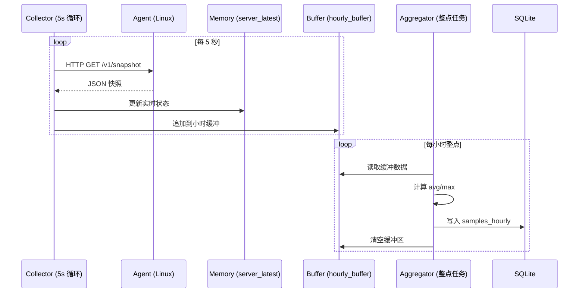
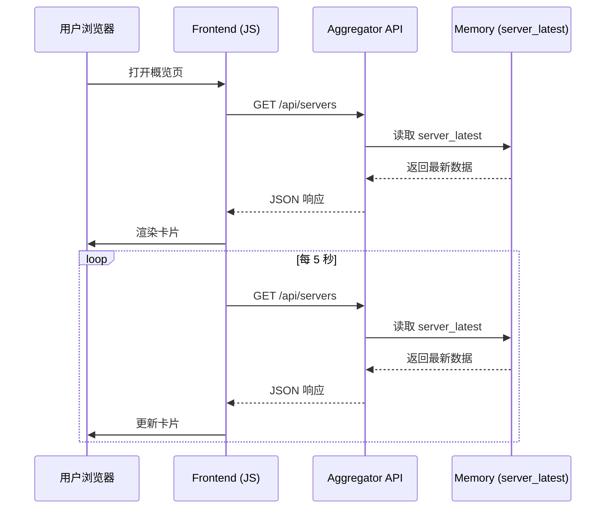

# 监控系统架构设计

> 本文档定义监控系统的文件组织结构、模块职责和功能分布

---

## 1. 项目整体目录结构

```
d:\dhga\server\
├── ops/
│   └── monitor/                          # 监控系统根目录
│       ├── config.yaml                   # 中心节点配置文件
│       ├── schema.sql                    # 数据库初始化脚本
│       ├── README.md                     # 部署文档
│       │
│       ├── agent/                        # Agent 端代码（部署到 Linux）
│       │   ├── monitor_agent/            # Python 包
│       │   │   ├── __init__.py
│       │   │   ├── app.py               # FastAPI 应用入口
│       │   │   ├── config.py            # 配置加载模块
│       │   │   ├── collectors/          # 数据采集器
│       │   │   │   ├── __init__.py
│       │   │   │   ├── cpu.py           # CPU 采集
│       │   │   │   ├── disk.py          # 磁盘采集
│       │   │   │   ├── gpu.py           # GPU 采集（NVIDIA）
│       │   │   │   └── systemd.py       # systemd 服务状态采集
│       │   │   ├── models.py            # 数据模型（Pydantic）
│       │   │   └── utils.py             # 工具函数
│       │   ├── requirements.txt         # Python 依赖
│       │   ├── setup.py                 # 打包配置
│       │   └── config.example.yaml      # 配置文件模板
│       │
│       ├── aggregator/                   # Aggregator 端代码（Windows 中心节点）
│       │   ├── monitor_aggregator/       # Python 包
│       │   │   ├── __init__.py
│       │   │   ├── main.py              # 主程序入口
│       │   │   ├── config.py            # 配置加载
│       │   │   ├── collector.py         # 5s 采集循环
│       │   │   ├── aggregator.py        # 小时聚合任务
│       │   │   ├── event_detector.py    # 事件检测逻辑
│       │   │   ├── database.py          # 数据库操作抽象层
│       │   │   ├── models.py            # 数据模型
│       │   │   └── api/                 # REST API
│       │   │       ├── __init__.py
│       │   │       ├── app.py           # FastAPI 应用
│       │   │       ├── routers/         # API 路由
│       │   │       │   ├── __init__.py
│       │   │       │   ├── servers.py   # 服务器管理 API
│       │   │       │   ├── timeseries.py # 时间序列 API
│       │   │       │   └── events.py    # 事件 API
│       │   │       └── dependencies.py  # 依赖注入
│       │   ├── requirements.txt
│       │   └── service.json             # NSSM 服务配置
│       │
│       ├── frontend/                     # 前端 Dashboard
│       │   ├── index.html               # 概览页
│       │   ├── server-detail.html       # 服务器详情页
│       │   ├── servers-manage.html      # 服务器管理页
│       │   ├── events.html              # 事件页
│       │   ├── assets/                  # 静态资源
│       │   │   ├── css/
│       │   │   │   ├── tabler.min.css   # Tabler 框架
│       │   │   │   └── custom.css       # 自定义样式
│       │   │   ├── js/
│       │   │   │   ├── tabler.min.js    # Tabler 框架
│       │   │   │   ├── chart.min.js     # 图表库（Chart.js / ECharts）
│       │   │   │   ├── api-client.js    # API 客户端封装
│       │   │   │   ├── overview.js      # 概览页逻辑
│       │   │   │   ├── server-detail.js # 详情页逻辑
│       │   │   │   └── servers-manage.js # 管理页逻辑
│       │   │   └── img/
│       │   └── config.js                # 前端配置（API 地址）
│       │
│       ├── data/                         # 数据目录
│       │   ├── monitor.db               # SQLite 数据库
│       │   ├── monitor.db-shm           # WAL 模式共享内存
│       │   └── monitor.db-wal           # WAL 日志
│       │
│       ├── backup/                       # 备份目录
│       │   └── monitor-YYYYMMDD.db      # 每日备份
│       │
│       └── scripts/                      # 运维脚本
│           ├── deploy-agent.sh          # Agent 部署脚本（Linux）
│           ├── init-db.ps1              # 数据库初始化（PowerShell）
│           ├── backup-db.ps1            # 数据库备份（PowerShell）
│           └── health-check.ps1         # 健康巡检（PowerShell）
│
├── docs/
│   └── monitoring/
│       ├── monitoring-plan.md           # 监控方案（已完成）
│       └── architecture.md              # 本文档
│
└── services/                             # NSSM 服务框架（已有）
    └── monitor-aggregator/              # 新增监控服务
        └── service.json
```

---

## 2. Agent 端架构设计

### 2.1 核心职责
- 提供 HTTP 接口供中心节点拉取数据
- 实时采集本机 CPU/磁盘/GPU/服务状态
- 支持健康检查和服务发现
- 轻量化运行，资源占用 < 100MB 内存、5% CPU

### 2.2 模块设计

#### 2.2.1 `app.py` - FastAPI 应用入口
```python
from fastapi import FastAPI, Header, HTTPException
from monitor_agent.config import config
from monitor_agent.collectors import cpu, disk, gpu, systemd
from monitor_agent.models import SnapshotResponse, HealthResponse

app = FastAPI(title="Monitor Agent", version="1.0.0")

@app.get("/v1/snapshot")
async def get_snapshot(authorization: str = Header(None)):
    # Token 验证
    # 调用各采集器
    # 返回聚合快照

@app.get("/v1/health")
async def get_health():
    # 健康检查：测试各采集器是否正常

@app.get("/v1/services")
async def list_services(authorization: str = Header(None)):
    # 服务发现：返回可监控的 systemd 服务列表
```

**功能清单**：
- Token 验证（Bearer 方式）
- 并发调用所有采集器（`asyncio.gather`）
- 异常处理：单个采集器失败不影响整体
- 响应格式标准化（符合方案文档中的 JSON 结构）

---

#### 2.2.2 `collectors/` - 数据采集器

**设计原则**：
- 每个采集器独立、无状态
- 支持优雅降级（如 GPU 不可用时返回 None）
- 避免阻塞：耗时操作使用 `asyncio.create_subprocess_shell`

##### `cpu.py` - CPU 采集器
```python
async def get_cpu_percent() -> float:
    """
    采集 CPU 使用率
    
    实现方式：读取 /proc/stat 两次，计算 delta
    返回：0~100 的浮点数
    """
```

**关键逻辑**：
- 维护上一次采样值（进程级全局变量）
- 计算公式：`(total_delta - idle_delta) / total_delta * 100`
- 首次调用返回 None（需要两次采样）

##### `disk.py` - 磁盘采集器
```python
async def get_disk_usage(mount_points: list[str]) -> list[dict]:
    """
    采集磁盘使用率
    
    参数：mount_points - 挂载点列表（如 ["/", "/data"]）
    返回：[{"mount": "/", "used_bytes": ..., "total_bytes": ..., "used_pct": ...}]
    """
```

**实现方式**：
- 使用 `psutil.disk_usage(mount_point)`
- 或解析 `df -P <mount_point>` 输出

##### `gpu.py` - GPU 采集器
```python
async def get_gpu_stats() -> list[dict] | None:
    """
    采集 GPU 使用率和显存
    
    返回：[{"index": 0, "util_pct": 56, "mem_used_mb": 2048, "mem_total_mb": 8192}]
    或 None（无 GPU 或驱动不可用）
    """
```

**实现方式**：
- 执行命令：`nvidia-smi --query-gpu=index,utilization.gpu,memory.used,memory.total --format=csv,noheader,nounits`
- 解析 CSV 输出
- 异常处理：命令失败返回 None

##### `systemd.py` - systemd 服务采集器
```python
async def get_service_status(units: list[str]) -> list[dict]:
    """
    采集 systemd 服务状态
    
    参数：units - 服务列表（如 ["nginx.service", "docker.service"]）
    返回：[{"name": "nginx.service", "active_state": "active", "sub_state": "running"}]
    """
```

**实现方式**：
- 执行命令：`systemctl show <unit> --property=ActiveState,SubState`
- 解析输出
- 并发查询多个服务（`asyncio.gather`）

---

#### 2.2.3 `config.py` - 配置管理
```python
from pydantic import BaseModel
import yaml

class AgentConfig(BaseModel):
    node_id: str
    listen: str = "0.0.0.0:9109"
    token: str
    disks: list[str] = ["/"]
    services_allowlist: list[str] = []
    gpu: str = "auto"  # auto|off|nvidia

config = AgentConfig(**yaml.safe_load(open("/etc/monitor-agent/config.yaml")))
```

**功能**：
- YAML 加载
- 配置验证（Pydantic）
- 环境变量覆盖支持（可选）

---

#### 2.2.4 `models.py` - 数据模型
```python
from pydantic import BaseModel
from datetime import datetime

class DiskInfo(BaseModel):
    mount: str
    used_bytes: int
    total_bytes: int
    used_pct: float

class GPUInfo(BaseModel):
    index: int
    util_pct: float
    mem_used_mb: int
    mem_total_mb: int

class ServiceInfo(BaseModel):
    name: str
    active_state: str
    sub_state: str

class SnapshotResponse(BaseModel):
    node_id: str
    ts: datetime
    cpu_pct: float | None
    disks: list[DiskInfo]
    gpus: list[GPUInfo] | None
    services: list[ServiceInfo]

class HealthResponse(BaseModel):
    status: str  # ok|degraded|error
    timestamp: datetime
    checks: dict[str, str]
    details: dict[str, str | None]
```

---

### 2.3 部署流程

**自动化部署脚本**（`scripts/deploy-agent.sh`）：
```bash
#!/bin/bash
# 用法: ./deploy-agent.sh <server-ip> <node-id> <token>

SERVER_IP=$1
NODE_ID=$2
TOKEN=$3

# 1. 创建用户和目录
ssh root@$SERVER_IP "useradd --system --no-create-home --shell /usr/sbin/nologin monitor-agent || true"
ssh root@$SERVER_IP "mkdir -p /opt/monitor-agent /etc/monitor-agent"

# 2. 上传代码
scp -r ops/monitor/agent/* root@$SERVER_IP:/opt/monitor-agent/

# 3. 安装依赖
ssh root@$SERVER_IP "python3 -m venv /opt/monitor-agent/venv"
ssh root@$SERVER_IP "/opt/monitor-agent/venv/bin/pip install -r /opt/monitor-agent/requirements.txt"

# 4. 生成配置
ssh root@$SERVER_IP "cat > /etc/monitor-agent/config.yaml << EOF
node_id: \"$NODE_ID\"
listen: \"0.0.0.0:9109\"
token: \"$TOKEN\"
disks:
  - \"/\"
services_allowlist: []
gpu: \"nvidia\"
EOF"

# 5. 创建 systemd 服务
# ... (参考方案文档中的 systemd 配置)

# 6. 启动服务
ssh root@$SERVER_IP "systemctl daemon-reload && systemctl enable --now monitor-agent"
```

---

## 3. Aggregator 端架构设计

### 3.1 核心职责
- 每 5s 拉取所有 agent 数据
- 维护内存缓存（`server_latest`）
- 每小时聚合数据并入库
- 检测状态变化并生成事件
- 提供 REST API 给前端

### 3.2 模块设计

#### 3.2.1 `main.py` - 主程序入口
```python
import asyncio
from monitor_aggregator.collector import run_collector
from monitor_aggregator.aggregator import run_aggregator
from monitor_aggregator.api.app import create_app

async def main():
    # 启动三个并发任务
    await asyncio.gather(
        run_collector(),      # 5s 采集循环
        run_aggregator(),     # 小时聚合任务
        run_api_server()      # REST API 服务
    )

if __name__ == "__main__":
    asyncio.run(main())
```

---

#### 3.2.2 `collector.py` - 5s 采集循环
```python
import asyncio
import httpx
from monitor_aggregator.database import db
from monitor_aggregator.event_detector import detect_events
from monitor_aggregator.models import server_latest, hourly_buffer

async def run_collector():
    """每 5s 拉取所有 agent 并更新缓存"""
    while True:
        servers = db.get_enabled_servers()
        
        # 并发拉取所有 agent
        tasks = [fetch_agent(server) for server in servers]
        results = await asyncio.gather(*tasks, return_exceptions=True)
        
        for server, result in zip(servers, results):
            if isinstance(result, Exception):
                # 拉取失败 → 标记离线
                server_latest[server.id] = {"online": False, ...}
                await detect_events(server.id, False, [])
            else:
                # 拉取成功 → 更新缓存
                server_latest[server.id] = {
                    "online": True,
                    "ts": result["ts"],
                    "cpu_pct": result["cpu_pct"],
                    # ...
                }
                hourly_buffer[server.id].append(result)
                await detect_events(server.id, True, result.get("services", []))
                
                # 更新 last_seen_at
                db.update_last_seen(server.id, result["ts"])
        
        await asyncio.sleep(5)

async def fetch_agent(server) -> dict:
    """拉取单个 agent 数据"""
    async with httpx.AsyncClient(timeout=2.0) as client:
        response = await client.get(
            f"http://{server.host}:{server.agent_port}/v1/snapshot",
            headers={"Authorization": f"Bearer {server.token}"}
        )
        response.raise_for_status()
        return response.json()
```

**关键设计**：
- 使用 `httpx.AsyncClient` 并发拉取
- 超时设置 2 秒
- 连接池复用（`async with` 自动管理）
- 异常隔离：单台失败不影响其他

---

#### 3.2.3 `aggregator.py` - 小时聚合任务
```python
import asyncio
from datetime import datetime, timedelta
from monitor_aggregator.database import db
from monitor_aggregator.models import hourly_buffer

async def run_aggregator():
    """每小时整点执行聚合"""
    while True:
        # 等到下一个整点
        now = datetime.now()
        next_hour = (now + timedelta(hours=1)).replace(minute=0, second=0, microsecond=0)
        await asyncio.sleep((next_hour - now).total_seconds())
        
        # 聚合所有服务器的缓冲数据
        for server_id, snapshots in hourly_buffer.items():
            if not snapshots:
                continue
            
            # 计算聚合指标
            cpu_values = [s["cpu_pct"] for s in snapshots if s.get("cpu_pct") is not None]
            gpu_values = [s["gpus"][0]["util_pct"] for s in snapshots if s.get("gpus")]
            
            cpu_avg = sum(cpu_values) / len(cpu_values) if cpu_values else None
            cpu_max = max(cpu_values) if cpu_values else None
            gpu_avg = sum(gpu_values) / len(gpu_values) if gpu_values else None
            gpu_max = max(gpu_values) if gpu_values else None
            
            # 磁盘取最后快照
            last = snapshots[-1]
            
            # 写入数据库
            db.save_hourly_sample(
                server_id=server_id,
                ts=next_hour,
                cpu_pct_avg=cpu_avg,
                cpu_pct_max=cpu_max,
                disk_used_pct=last["disks"][0]["used_pct"],
                gpu_util_pct_avg=gpu_avg,
                gpu_util_pct_max=gpu_max,
                # ...
            )
        
        # 清空缓冲区
        hourly_buffer.clear()
```

---

#### 3.2.4 `event_detector.py` - 事件检测
```python
from monitor_aggregator.database import db

prev_state = {}  # 全局状态缓存

async def detect_events(server_id: int, online: bool, services: list[dict]):
    """检测状态变化并保存事件"""
    events = []
    prev = prev_state.get(server_id, {})
    
    # 在线状态变化
    if prev.get("online") is True and online is False:
        events.append({"type": "server_down", "message": "Server went offline"})
    elif prev.get("online") is False and online is True:
        events.append({"type": "server_up", "message": "Server came back online"})
    
    # 服务状态变化
    if services:
        prev_services = prev.get("services", {})
        for svc in services:
            unit = svc["name"]
            curr_state = svc["active_state"]
            prev_svc_state = prev_services.get(unit)
            
            if prev_svc_state == "active" and curr_state == "failed":
                events.append({"type": "service_failed", "message": f"{unit} failed"})
            elif prev_svc_state == "failed" and curr_state == "active":
                events.append({"type": "service_recovered", "message": f"{unit} recovered"})
    
    # 保存事件
    for event in events:
        db.save_event(server_id, event["type"], event["message"])
    
    # 更新缓存
    prev_state[server_id] = {
        "online": online,
        "services": {s["name"]: s["active_state"] for s in services}
    }
```

---

#### 3.2.5 `database.py` - 数据库抽象层
```python
import sqlite3
from contextlib import contextmanager
from monitor_aggregator.config import config

class Database:
    def __init__(self, db_path: str):
        self.db_path = db_path
        self._init_db()
    
    def _init_db(self):
        """初始化数据库（执行 schema.sql）"""
        pass
    
    @contextmanager
    def get_conn(self):
        """上下文管理器：获取数据库连接"""
        conn = sqlite3.connect(self.db_path)
        conn.row_factory = sqlite3.Row
        try:
            yield conn
            conn.commit()
        except:
            conn.rollback()
            raise
        finally:
            conn.close()
    
    def get_enabled_servers(self) -> list:
        """获取所有启用的服务器"""
        with self.get_conn() as conn:
            return conn.execute("SELECT * FROM servers WHERE enabled = 1").fetchall()
    
    def update_last_seen(self, server_id: int, ts: str):
        """更新服务器最后在线时间"""
        with self.get_conn() as conn:
            conn.execute("UPDATE servers SET last_seen_at = ? WHERE id = ?", (ts, server_id))
    
    def save_hourly_sample(self, server_id: int, ts, cpu_pct_avg, cpu_pct_max, ...):
        """保存小时聚合样本"""
        with self.get_conn() as conn:
            conn.execute("""
                INSERT INTO samples_hourly (server_id, ts, cpu_pct_avg, cpu_pct_max, ...)
                VALUES (?, ?, ?, ?, ...)
            """, (server_id, ts, cpu_pct_avg, cpu_pct_max, ...))
    
    def save_event(self, server_id: int, event_type: str, message: str):
        """保存事件"""
        # 去重逻辑：1 分钟内同类型事件只记录一次
        pass
    
    # ... 其他 CRUD 方法

db = Database(config.database_path)
```

---

#### 3.2.6 `api/` - REST API

##### 路由设计

**`routers/servers.py`** - 服务器管理
```python
from fastapi import APIRouter, HTTPException
from monitor_aggregator.database import db
from monitor_aggregator.models import server_latest

router = APIRouter(prefix="/api/servers", tags=["servers"])

@router.get("/")
async def list_servers():
    """获取所有服务器及最新状态"""
    servers = db.get_all_servers()
    return [
        {
            **dict(server),
            "latest": server_latest.get(server["id"]),
            "online": server_latest.get(server["id"], {}).get("online", False)
        }
        for server in servers
    ]

@router.post("/")
async def create_server(name: str, host: str, ...):
    """添加服务器"""
    pass

@router.put("/{server_id}")
async def update_server(server_id: int, ...):
    """更新服务器配置"""
    pass

@router.delete("/{server_id}")
async def delete_server(server_id: int):
    """删除服务器"""
    pass

@router.get("/{server_id}/services/catalog")
async def discover_services(server_id: int):
    """服务发现：调用 agent 的 /v1/services 端点"""
    pass
```

**`routers/timeseries.py`** - 时间序列
```python
@router.get("/api/servers/{server_id}/timeseries")
async def get_timeseries(
    server_id: int,
    metric: str,  # cpu_pct|disk_used_pct|gpu_util_pct
    from_ts: str,
    to_ts: str,
    agg: str = "avg"  # avg|max
):
    """查询历史时间序列数据"""
    data = db.query_timeseries(server_id, metric, from_ts, to_ts, agg)
    return {
        "server_id": server_id,
        "metric": metric,
        "agg": agg,
        "data": [{"ts": row["ts"], "value": row["value"]} for row in data]
    }
```

**`routers/events.py`** - 事件
```python
@router.get("/api/events")
async def list_events(limit: int = 200):
    """获取最近事件"""
    return db.get_recent_events(limit)
```

---

### 3.3 NSSM 服务配置

**`service.json`**：
```json
{
  "name": "MonitorAggregator",
  "displayName": "Monitor Aggregator",
  "description": "Server monitoring aggregator and API service",
  "exe": "C:\\Python311\\python.exe",
  "args": [
    "-m",
    "monitor_aggregator.main"
  ],
  "workDir": "d:\\dhga\\server\\ops\\monitor\\aggregator",
  "stdout": "d:\\dhga\\server\\logs\\monitor-aggregator\\stdout.log",
  "stderr": "d:\\dhga\\server\\logs\\monitor-aggregator\\stderr.log",
  "autoRestart": true
}
```

---

## 4. 前端架构设计

### 4.1 技术栈
- **框架**：Tabler（纯 HTML/JS/CSS，无需构建）
- **图表**：ECharts（适合时间序列）
- **HTTP 客户端**：原生 `fetch()` + 封装
- **刷新策略**：`setInterval()` 5s 轮询

### 4.2 页面结构

#### 4.2.1 `index.html` - 概览页
**布局**：
- 顶部导航栏（概览 | 服务器管理 | 事件）
- 服务器卡片网格（每台一张卡片）
  - 在线状态（绿/红指示灯）
  - 最新指标（CPU/磁盘/GPU 进度条）
  - 服务异常数（红色徽章）
  - 点击跳转详情页

**核心逻辑**（`assets/js/overview.js`）：
```javascript
let servers = [];

async function loadServers() {
  const response = await fetch('/api/servers');
  servers = await response.json();
  renderServerCards(servers);
}

function renderServerCards(servers) {
  const container = document.getElementById('server-cards');
  container.innerHTML = servers.map(server => `
    <div class="col-md-4">
      <div class="card">
        <div class="card-header">
          <h3>${server.name}</h3>
          <span class="badge ${server.online ? 'bg-success' : 'bg-danger'}">
            ${server.online ? 'Online' : 'Offline'}
          </span>
        </div>
        <div class="card-body">
          <div class="mb-2">
            <label>CPU</label>
            <div class="progress">
              <div class="progress-bar" style="width: ${server.latest?.cpu_pct || 0}%"></div>
            </div>
          </div>
          <!-- 磁盘、GPU 进度条 -->
        </div>
        <div class="card-footer">
          <a href="server-detail.html?id=${server.id}" class="btn btn-primary">查看详情</a>
        </div>
      </div>
    </div>
  `).join('');
}

// 5s 刷新
setInterval(loadServers, 5000);
loadServers();
```

---

#### 4.2.2 `server-detail.html` - 服务器详情页
**布局**：
- 顶部：服务器基本信息（名称、IP、在线状态）
- 中部：指标卡片（CPU/磁盘/GPU 当前值）
- 底部：时间序列图表（可切换 1h/6h/24h/7d）
- 侧边栏：服务状态列表

**图表实现**（ECharts）：
```javascript
const chart = echarts.init(document.getElementById('cpu-chart'));

async function loadTimeseries(serverId, metric, range) {
  const from = new Date(Date.now() - range * 3600000).toISOString();
  const to = new Date().toISOString();
  
  const response = await fetch(
    `/api/servers/${serverId}/timeseries?metric=${metric}&from=${from}&to=${to}&agg=avg`
  );
  const data = await response.json();
  
  chart.setOption({
    xAxis: { type: 'time' },
    yAxis: { type: 'value', max: 100 },
    series: [{
      type: 'line',
      data: data.data.map(d => [d.ts, d.value]),
      smooth: true
    }]
  });
}
```

---

#### 4.2.3 `servers-manage.html` - 服务器管理页
**功能**：
- 表格展示所有服务器（含禁用的）
- 添加按钮 → 弹出表单（名称、IP、端口、Token、服务列表）
- 编辑按钮 → 预填表单
- 删除按钮 → 确认对话框
- "发现服务"按钮 → 调用 `/api/servers/{id}/services/catalog` 并显示勾选框

---

#### 4.2.4 `events.html` - 事件页
**布局**：
- 时间线展示（Timeline 组件）
- 事件类型过滤器（下拉菜单）
- 分页（每页 50 条）

---

### 4.3 API 客户端封装

**`assets/js/api-client.js`**：
```javascript
const API_BASE = 'http://localhost:8080';  // 从 config.js 加载

class APIClient {
  async getServers() {
    const response = await fetch(`${API_BASE}/api/servers`);
    if (!response.ok) throw new Error('Failed to fetch servers');
    return response.json();
  }
  
  async getTimeseries(serverId, metric, from, to, agg = 'avg') {
    const params = new URLSearchParams({ metric, from, to, agg });
    const response = await fetch(`${API_BASE}/api/servers/${serverId}/timeseries?${params}`);
    return response.json();
  }
  
  async createServer(data) {
    const response = await fetch(`${API_BASE}/api/servers`, {
      method: 'POST',
      headers: { 'Content-Type': 'application/json' },
      body: JSON.stringify(data)
    });
    return response.json();
  }
  
  // ... 其他方法
}

const api = new APIClient();
```

---

## 5. 部署工具设计

### 5.1 `scripts/deploy-agent.sh`
**功能**：
- 自动化部署 agent 到 Linux 服务器
- 参数：服务器 IP、node_id、token
- 步骤：创建用户 → 上传代码 → 安装依赖 → 配置 → 启动服务

（详见上文 Agent 端架构部分）

---

### 5.2 `scripts/init-db.ps1`
**功能**：初始化 SQLite 数据库

```powershell
# 检查数据库是否存在
if (Test-Path "ops\monitor\data\monitor.db") {
    Write-Host "Database already exists. Skipping initialization."
    exit 0
}

# 创建数据目录
New-Item -ItemType Directory -Force -Path "ops\monitor\data" | Out-Null

# 执行 schema.sql
sqlite3.exe ops\monitor\data\monitor.db < ops\monitor\schema.sql

Write-Host "Database initialized successfully."
```

---

### 5.3 `scripts/backup-db.ps1`
（详见方案文档中的备份脚本）

---

### 5.4 `scripts/health-check.ps1`
**功能**：快速检测所有组件健康状态

```powershell
# 检查 aggregator 服务状态
$service = Get-Service -Name "MonitorAggregator" -ErrorAction SilentlyContinue
if ($service.Status -ne "Running") {
    Write-Host "❌ Aggregator service is not running"
}

# 检查 API 可用性
try {
    $response = Invoke-WebRequest -Uri "http://localhost:8080/api/servers" -UseBasicParsing
    Write-Host "✅ API is responding"
} catch {
    Write-Host "❌ API is not responding"
}

# 检查数据库大小
$dbSize = (Get-Item "ops\monitor\data\monitor.db").Length / 1MB
Write-Host "📊 Database size: $dbSize MB"

# 检查每台 agent
# ... (循环读取配置并测试连接)
```

---

## 6. 核心流程图

### 6.1 数据采集与存储流程



### 6.2 前端刷新流程



---

## 7. 技术选型汇总

| 组件 | 技术栈 | 理由 |
|------|--------|------|
| Agent | Python 3.8+ + FastAPI + psutil | 轻量、易部署、跨平台 |
| Aggregator | Python 3.8+ + FastAPI + asyncio + SQLite | 与现有项目栈一致、异步高效 |
| 数据库 | SQLite (WAL 模式) | 轻量、无需独立服务、适合单节点 |
| 前端 | Tabler + ECharts + Vanilla JS | 无需构建、快速开发、组件丰富 |
| 部署 | systemd (Linux) + NSSM (Windows) | 标准服务管理、自动重启 |

---

## 8. 开发优先级

### Phase 1 - MVP 核心功能（1 周）
1. ✅ Agent 基础功能（CPU/磁盘/GPU 采集 + /v1/snapshot 端点）
2. ✅ Aggregator 5s 采集循环 + 内存缓存
3. ✅ 数据库 schema + 基础 CRUD
4. ✅ REST API（GET /api/servers）
5. ✅ 前端概览页（展示在线状态 + 最新指标）

### Phase 2 - 历史数据与图表（3 天）
1. ✅ 小时聚合任务
2. ✅ 时间序列 API
3. ✅ 详情页图表（ECharts 集成）

### Phase 3 - 事件与管理（2 天）
1. ✅ 事件检测逻辑
2. ✅ 服务器管理页（CRUD）
3. ✅ 事件页

### Phase 4 - 运维工具（1 天）
1. ✅ 部署脚本
2. ✅ 备份脚本
3. ✅ 健康检查脚本

---

## 9. 下一步

如需开始实现代码，请提供：
1. 服务器详细信息（IP、名称）
2. 确认使用 **Python** 实现 Agent 和 Aggregator（推荐）
3. 确认中心节点前端监听端口（默认 8080）

我将开始编写：
- `ops/monitor/agent/` 完整代码
- `ops/monitor/aggregator/` 完整代码
- `ops/monitor/frontend/` 完整页面
- `ops/monitor/scripts/` 部署脚本
- `ops/monitor/schema.sql` 数据库初始化

所有代码将遵循本架构文档的设计，并包含完整的注释和错误处理。
